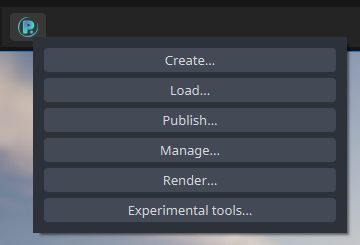
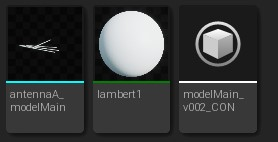
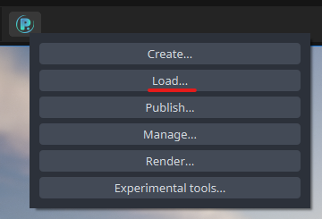
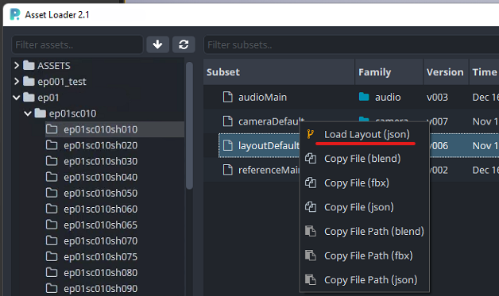
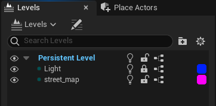
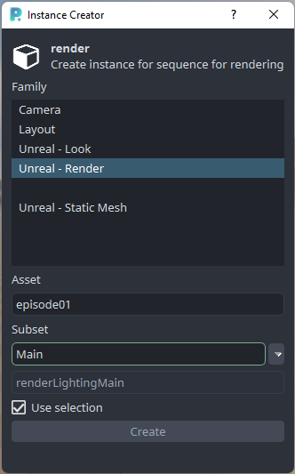
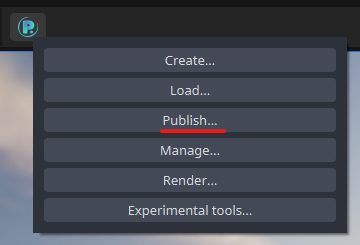

## Introduction

OpenPype supports Unreal in similar ways as in other DCCs Yet there are few specific you need to be aware of.

### Creating the Unreal project

Selecting a task and opening it with Unreal will generate the Unreal project, if it hasn't been created before.
By default, OpenPype includes the plugin that will be built together with the project.

Alternatively, the Environment variable `"OPENPYPE_UNREAL_PLUGIN"` can be set to the path of a compiled version of the plugin.
The version of the compiled plugin must match the version of Unreal with which the project is being created.

:::note
Unreal version 5.0 onwards requires the following Environment variable:

`"UE_PYTHONPATH": "{PYTHONPATH}"`
:::

### Project naming

Unreal doesn't support project names starting with non-alphabetic character. So names like `123_myProject` are
invalid. If OpenPype detects such name it automatically prepends letter **P** to make it valid name, so `123_myProject` will become `P123_myProject`. There is also soft-limit on project name length to be shorter then 20 characters. Longer names will issue warning in Unreal Editor that there might be possible side effects.

## OpenPype global tools

OpenPype global tools can be found in Unreal's toolbar and in the *Tools* main menu:

-   [Create](artist_tools.md#creator)
-   [Load](artist_tools.md#loader)
-   [Manage (Inventory)](artist_tools.md#inventory)
-   [Publish](artist_tools.md#publisher)
-   [Library Loader](artist_tools.md#library-loader)

## Static Mesh

### Loading

To import Static Mesh model, just choose **OpenPype → Load ...** and select your mesh. Static meshes are transferred as FBX files as specified in [Unreal Engine 4 Static Mesh Pipeline](https://docs.unrealengine.com/en-US/Engine/Content/Importing/FBX/StaticMeshes/index.html). This action will create new folder with subset name (`unrealStaticMeshMain_CON` for example) and put all data into it. Inside, you can find:

In this case there is **lambert1**, material pulled from Maya when this static mesh was published, **antennaA_modelMain** is the geometry itself, **modelMain_v002_CON** is a *AssetContainer* type and is there to mark this directory as Avalon Container (to track changes) and to hold OpenPype metadata.

### Publishing

Publishing of Static Mesh works in similar ways. Select your mesh in *Content Browser* and **OpenPype → Create ...**. This will create folder named by subset you've chosen - for example **unrealStaticMeshDefault_INS**. It this folder is that mesh and *Avalon Publish Instance* asset marking this folder as publishable instance and holding important metadata on it. If you want to publish this instance, go **OpenPype → Publish ...**

## Layout

There are two different layout options in Unreal, depending on the type of project you are working on.
One only imports the layout, and saves it in a level.
The other uses [Master Sequences](https://docs.unrealengine.com/4.27/en-US/AnimatingObjects/Sequencer/Overview/TracksShot/) to track the whole level sequence hierarchy.
You can choose in the Project Settings if you want to generate the level sequences.

### Loading

To load a layout, click on the OpenPype icon in Unreal’s main taskbar, and select **Load**.

Select the task on the left, then right click on the layout asset and select **Load Layout**.

If you need to load multiple layouts, you can select more than one task on the left, and you can load them together.

### Navigating the project

The layout will be imported in the directory `/Content/OpenPype`. The layout will be split into two subfolders: 
- *Assets*, which will contain all the rigs and models contained in the layout;
- *Asset name* (in the following example, *episode 2*), a folder named as the **asset** of the current **task**.

If you chose to generate the level sequences, in the second folder you will find the master level for the task (usually an episode), the level sequence and the folders for all the scenes in the episodes.
Otherwise you will find the level generated for the loaded layout.

#### Layout without level sequences

In the layout folder, you will find the level with the imported layout and an object of *AssetContainer* type. The latter is there to mark this directory as Avalon Container (to track changes) and to hold OpenPype metadata.

The layout level will and should contain only the data included in the layout. To add lighting, or other elements, like an environment, you have to create a master level, and add the layout level as a [streaming level](https://docs.unrealengine.com/5.0/en-US/level-streaming-in-unreal-engine/).

Create the master level and open it. Then, open the *Levels* window (from the menu **Windows → Levels**). Click on **Levels → Add Existing** and select the layout level and the other levels you with to include in the scene. The following example shows a master level in which have been added a light level and the layout level.

#### Layout with level sequences

In the episode folder, you will find the master level for the episode, the master level sequence and the folders for all the scenes in the episodes.

After opening the master level, open the *Levels* window (from the menu **Windows → Levels**), and you will see the list of the levels of each shot of the episode for which a layout has been loaded.

If it has not been added already, you will need to add the environment to the level. Click on **Levels → Add Existing** and select the level with the environment (check with the studio where it is located).

After adding the environment level to the master level, you will need to set it as always loaded by right clicking it, and selecting **Change Streaming Method** and selecting **Always Loaded**.

### Update layouts

To manage loaded layouts, click on the OpenPype icon in Unreal’s main taskbar, and select **Manage**.

You will get a list of all the assets that have been loaded in the project.
The version number will be in red if it isn’t the latest version. Right click on the element, and select Update if you need to update the layout.

:::note
**DO NOT** update rigs or models imported with a layout. Update only the layout.
:::

## Rendering

:::note
The rendering requires a layout loaded with the option to create the level sequences **on**.
:::

To render and publish an episode, a scene or a shot, you will need to create a publish instance. The publish instance for the rendering is based on one level sequence. That means that if you want to render the whole episode, you will need to create it for the level sequence of the episode, but if you want to render just one shot, you will need to create it for that shot.

Navigate to the folder that contains the level sequence that you need to render. Select the level sequence, and then click on the OpenPype icon in Unreal’s main taskbar, and select **Create**.

In the Instance Creator, select **Unreal - Render**, give it a name, and click **Create**.

The render instance will be created in `/Content/OpenPype/PublishInstances`.

Select the instance you need to render, and then click on the OpenPype icon in Unreal’s main taskbar, and select **Render**. You can render more than one instance at a time, if needed. Just select all the instances that you need to render before selecting the **Render** button from the OpenPype menu.

Once the render is finished, click on the OpenPype icon in Unreal’s main taskbar, and select **Publish**.

On the left, you will see the render instances. They will be automatically reorganised to have an instance for each shot. So, for example, if you have created the render instance for the whole episode, here you will have an instance for each shot in the episode.

Click on the play button in the bottom right, and it will start the publishing process.
